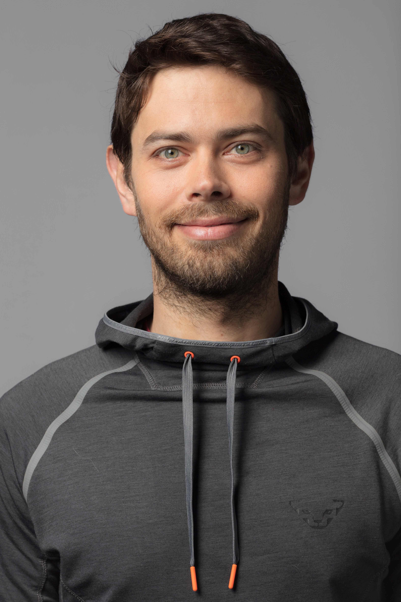

# Raphael Fanti 
{ align=left width="30%" }

Raphael has been **in love with knowledge** from early age. An **Engineer by nature**, Raphael has an unavoidable **systemic look** at things and thinks oriented to **solutions**. He **can't stop learning** and sees in Data Science and Programming a way to continuously **update his knowledge**.

Besides technology Raphael interested in many topics, such as **economics,  sociology, ethnology and living simply**. He truly believes technology is a mean to **improving ecosystems, including human ones**; but at the same time creates potential dangers that need to be thought through.

In his free time Raphael likes to **make things** (specially if with or for friends), to **go to the mountains** and to **study and practice Buddhism**.

## Professional experience

- 4 years of experience as **Strategy Consultant** with BCG
- 2 years of experience in the **Humanitarian sector** in Operations and Policy advisory
- 7 years of experience in **Innovation**, **Digital product development** and **Sustainability**
	- 2 years **structuring a Innovation function** for a small company in the French Alps
	- 3 years as **Digital Innovation Specialist** at Oberalp group
	- 2 years as **Sustainable Business Models Developer** at Oberalp group, reporting to  the CEO
- 1 semester experience as **adjoint University Professor** in **Sustainability** and **Social Entrepreneurship** at University of Trento

Raphael has worked with **renowned institutions**, having had the luck to be **surrounded by smart people** from whom he **learned a lot**:

{ width="24%" }
{ width="24%" }
{ width="24%" }
{ width="24%" }

## Academic track

* Several online courses in **Data Science** and **Web development**
* **Full time MBA** from Bocconi University with **merit scholarship**
* Two **Engineering** degrees (Double degree program)
	* **Robotics** Engineer from the Politechnic School of the University of Sao Paulo
	* **Industrial** Engineer from Ecole Centrale de Nantes in France
	* Prestigious **French government scholarship** for top international students (bourse Eiffel) covering 2 years of studies in France
* Golden medal in **Brazilian Physics Olympics** for last year high school students

<figure markdown>
  
</figure>