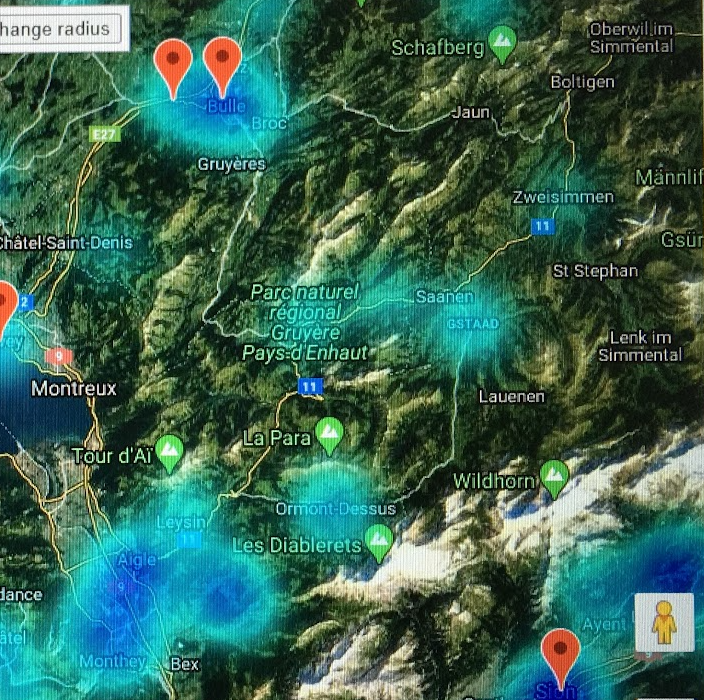
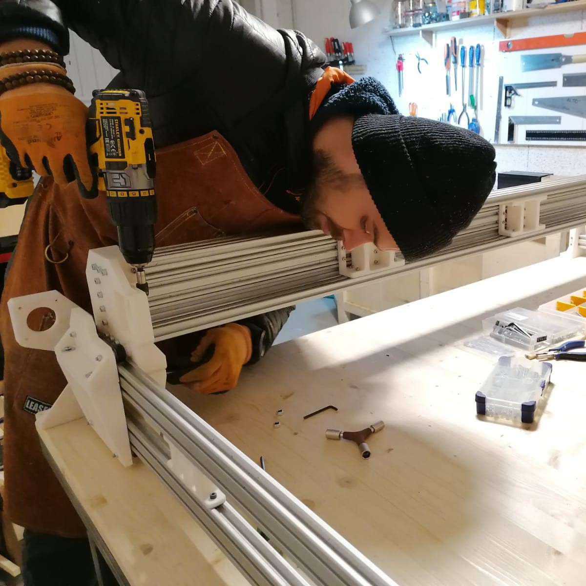
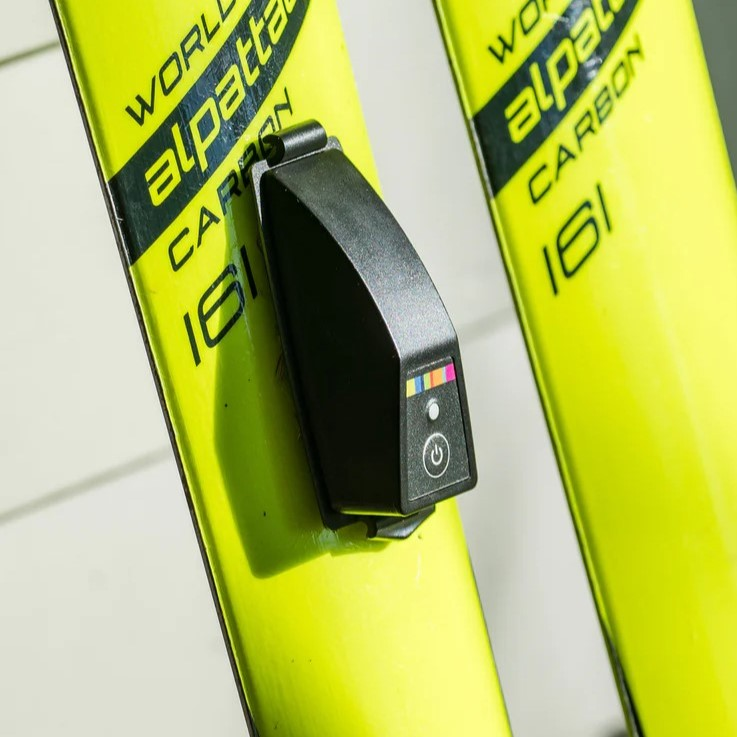
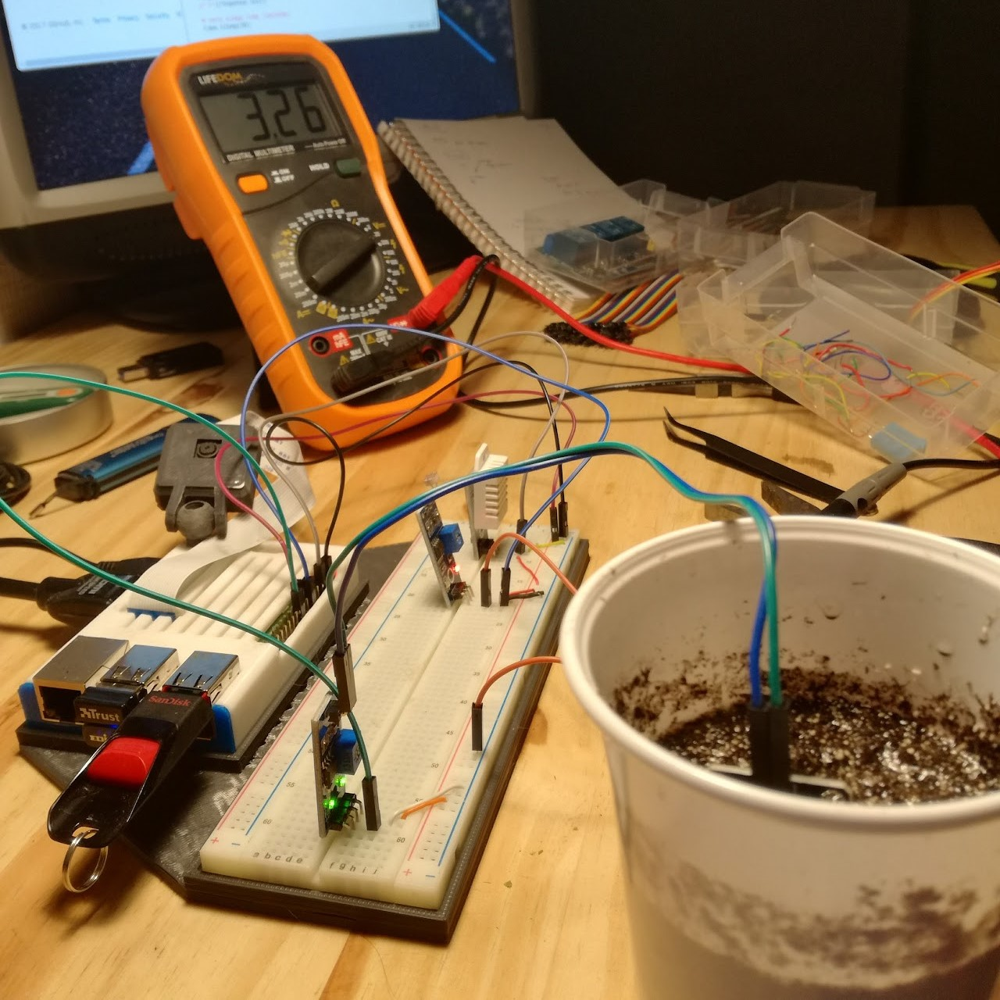

---
hide:
- toc
---
# Featured projects

!!! note ""

    { align=left width="17%" }
    ## Can machine learning predict the next hotspots for climbing gyms?
    
	Spoiler alert: it can do it much better than Excel! We have used advanced scrapping and machine learning to identify where will the Climbing market boom next.
	
	#### #WebScrapping #GradientBooster #UnitingDifferentDBs
	
	[:octicons-arrow-right-24: learn more about this project](projects/Climbing_market_analysis.md)
	
!!! note ""

	{ align=left width="17%" }
    ### Building a huge CNC machine during pandemics to realize a child's dream
    
	nulla. Curabitur feugiat, tortor non consequat finibus, justo purus auctor
    massa, nec semper lorem quam in massa.
	
	#### #Robotics #FastPrototyping #WoodWorking
	
	[:octicons-arrow-right-24: learn more about this project](projects/CNC_machine.md)

!!! note ""

	{ align=left width="17%" }
    ### Taking skiing analytics to the next level - BLE connection to Suunto watches
    
	nulla. Curabitur feugiat, tortor non consequat finibus, justo purus auctor
    massa, nec semper lorem quam in massa.	
	
	#### #tag1 #tag2 #tag3
	
	[:octicons-arrow-right-24: learn more about this project](projects/suunto_pomocup_connection.md)
	
!!! note ""

	{ align=left width="17%" }
    ### Is AI better than a person in classifying sport activities?
    
	nulla. Curabitur feugiat, tortor non consequat finibus, justo purus auctor
    massa, nec semper lorem quam in massa.
	
	#### #tag1 #tag2 #tag3
	
	[:octicons-arrow-right-24: learn more about this project](projects/strava_paragliding_classifier.md)
	
!!! note ""

	{ align=left width="17%" }
    ## Connecting a garden to the cloud
    
	nulla. Curabitur feugiat, tortor non consequat finibus, justo purus auctor
    massa, nec semper lorem quam in massa.
	
	#### #tag1 #tag2 #tag3
	
	[:octicons-arrow-right-24: learn more about this project](projects/iPlant_connected_garden.md)
	
