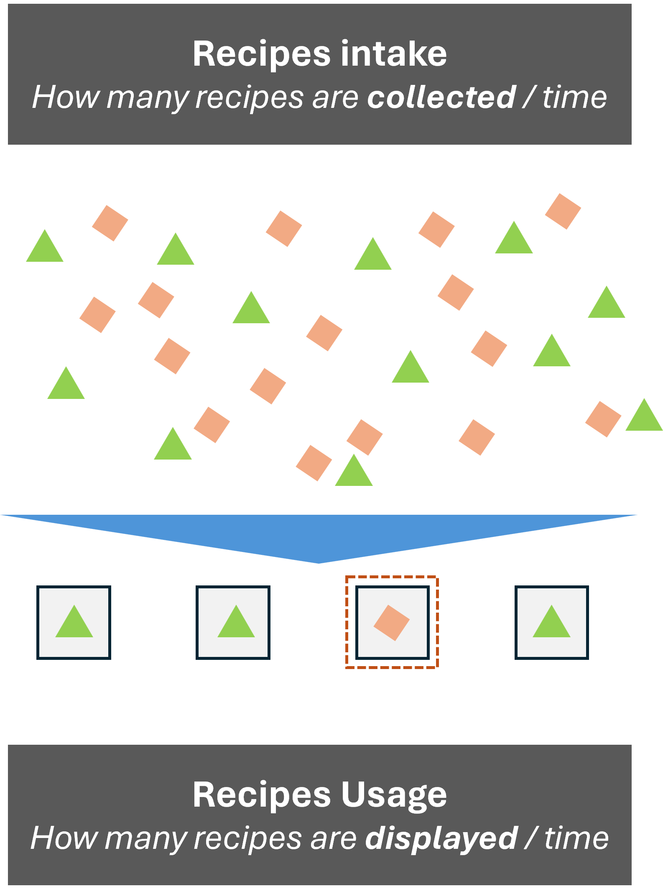

---
hide:
- toc
---
# Featured projects

!!! note ""

    { align=left width="17%" }
    ## A dirty job for LLMs
    
	Are LLMs a good solutiton to resolve recycling? In this project we make a fast prorotype of a computer vision and LLM solution to guide users about which bin to dispose reciclable waste based on a photo and their location

	
	#### #LLMs #ComputerVision #DataEngineering #ContanierDeployment
	
	[:octicons-arrow-right-24: learn more about this project](projects/trash_app.md)

!!! note ""

    { align=left width="17%" }
    ## What do Covid tests, customer churn rates and popular recipes have in common?
    
	Welcome to the world of binary classification: an old problem that is widely applicable to business problems. In this article we go through a journey of identifying good candidates for popular recipes on a website.
	
	#### #BinaryClassification #DataScienceForBusiness #LogisticsClassifier
	
	[:octicons-arrow-right-24: learn more about this project](projects/webpage_traffic_classifier.md)

!!! note ""

    { align=left width="17%" }
    ## Can machine learning predict the next hotspots for climbing gyms?
    
	Spoiler alert: it can do it much better than Excel! We have used advanced scrapping and machine learning to identify where will the Climbing market boom next.
	
	#### #WebScrapping #DataEngineering #EnsembleLearning
	
	[:octicons-arrow-right-24: learn more about this project](projects/Climbing_market_analysis.md)

!!! note ""

	{ align=left width="17%" }
    ### Taking skiing analytics to the next level - BLE connection to Suunto watches
    
	Bluetooth low energy at what it does best: small device connectivity and unleashing analytics potential in sports. In this project we have connected a ski touring logger to a Suunto watch.	
	
	#### #FitnessTracking #SuuntoBLE #EmbeddedSoft
	
	[:octicons-arrow-right-24: learn more about this project](projects/suunto_pomocup_connection.md)
	
!!! note ""

	{ align=left width="17%" }
    ### Is AI better than a person in classifying sport activities in Strava?
    
	Looking at an activity simple statistics (time elapsed, average speed, altitude gain / loss) we tried to measure effectiveness of classification algorithms to identify paragliding activies in Strava
	
	#### #DataScience #FitnessTracking #StravaAPI
	
	[:octicons-arrow-right-24: learn more about this project](projects/strava_paragliding_classifier.md)
	
!!! note ""

	{ align=left width="17%" }
    ## Connecting a garden to the cloud
    
	Garden analytics project leveraging knowledge in IoT (arduino, SigFox, secure API based information flows) and scalable full stack web development in Flask
	
	#### #IoT #WebDevelopment #TechForHumanitarian
	
	[:octicons-arrow-right-24: learn more about this project](projects/iPlant_connected_garden.md)
	
