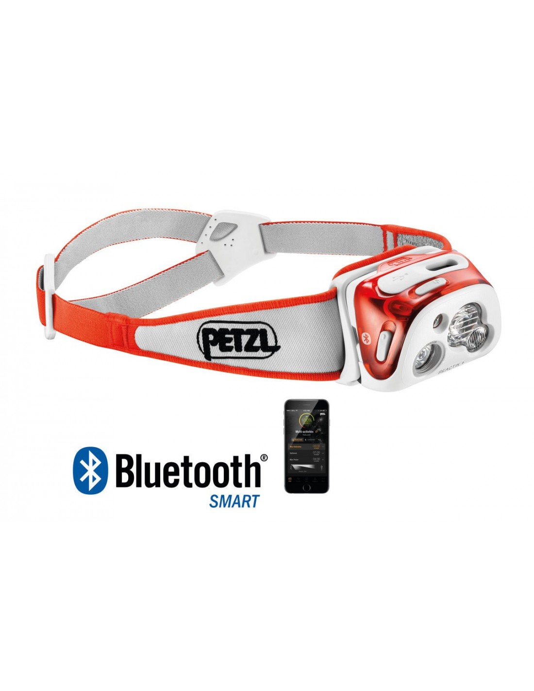
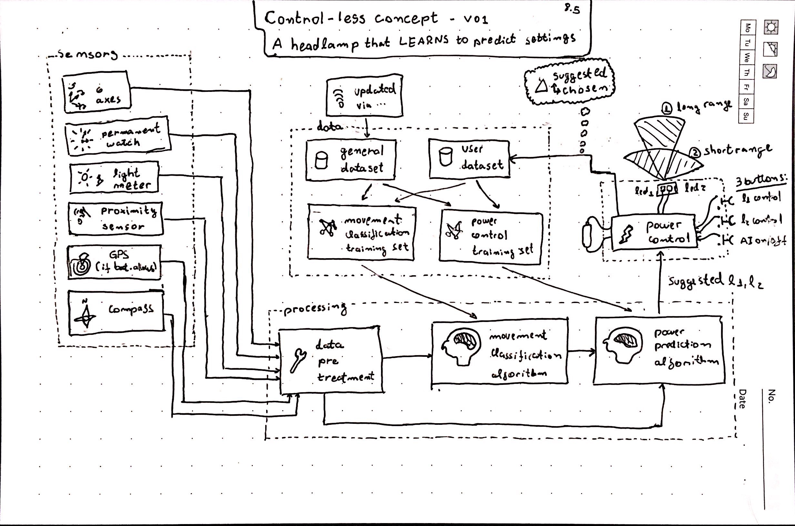

# The voice of the people

{ align=left width="20%" }

While working in Digital Innovation I had the opportunity to design and **facilitate product workshops**. One of the most interesting ones looked at Digital features for Outdoors headlamps, an event with over 40 users.

In that workshop we identified the **most desired features** in that product. The most wanted feature, by far, was **adaptability of the light beam**.

Translating that into real application we understood that our killer feature was a headlamp that **regulated itself** (power and form of the light beam) to user needs. In case a user adapted the proposed setting, the system would **learn his / her choice** for next times.

The idea for **"Control-Less" concept** for a headlamp was born. 

At the time the first headlamp models with **some connectivity** were arriving in Market. However, they focused on **connecting to a cellphone** for customization, which we believed was not of interest of most users. The few models with automatic adjustment were so basic that it **degraded the experience** instead of enhancing it. We had found the ideal feature for our product.

# The idea

<figure markdown>
  { width="100%" }
  <figcaption>The original sketch of an adaptable outdoors headlamp</figcaption>
</figure>

Our proposed "light controlling agent" does the following tasks:

* **Map environmental parameters** from a set of sensors (accellerometers / gyroscopes, GPS, Time of Flight sensor, light intensity sensor, etc.)
* From that mapping, **classify the activity** that the user is doing (initially from a list of n activities)
* Within that activity, **calculate activity-specific parameters**. For example while cycling or skiing downhill the light intensity should increase with speed. Additionally, the faster one goes, the more focused needs to be the bean in order to allow the user to concentrate on a smaller area
* From these calculations, **a recommended lighting setup is actioned** (varying light intensity and beam focus)
* In case the **user changes a setting**, record his preference alongside environmental parameters
* Keep listening to sensors to **identify a change in activity** or activity-specific parameters

The learning element of the approach guarantees that the training dataset used for to generate the "factory" model will **gradually be substituted by a user-generated dataset**. Over the air updates would allow to retrain and calibrate models in the cloud.

# The patent

Protecting a digital idea is quite hard! As a decision was made to patent the idea, we worked a lot to be able to **describe a young idea** (even before fully trying things out) to lawyers.

While discussing with the American Patent Office we ended finding **conflicts with lighting and AR patents from Phillips and Apple**. Having to identify loop holes in these giants' IP patrimony was exciting.

After months of work we were presented with the **recognition of the Patent** (link [here](https://www.lens.org/lens/patent/178-291-595-063-375/fulltext)).