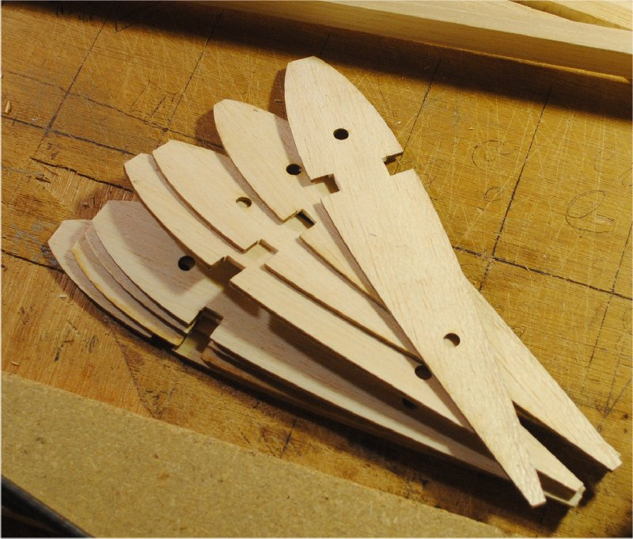
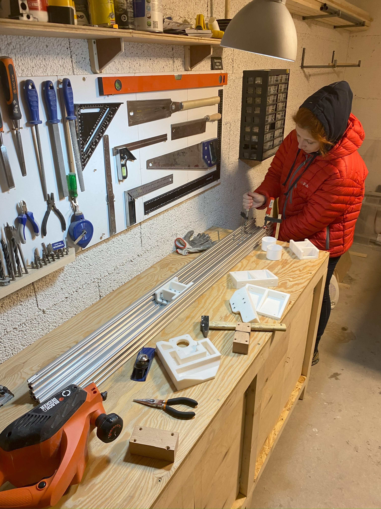
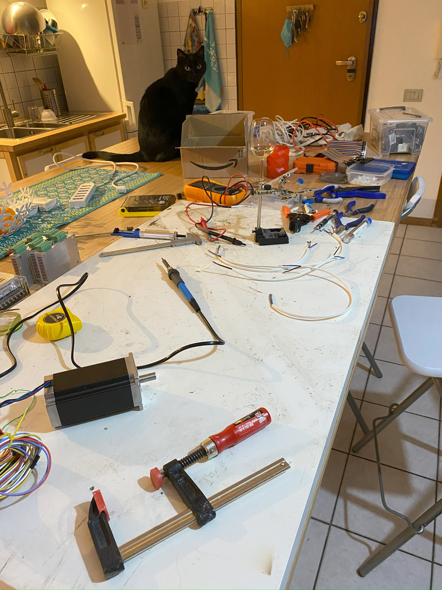

# The quintessential engineer quest

{ align=left width="25%" }

I spent lots of time during my adolescent years building **model airplanes**. At the time already playing around with computers, I dreamt of a machine that could **cut wood precisely to the shape of a wing profile** (Naca airfoil). Little did I know that during the 80's a technology was developed precisely for that: machining helicopter blades. It was to be called CNC and I was to meet it at university many years later.

I often think back at the moment I thought about that machine as **the moment I became an Engineer**. Like Mary Shelly, I wanted to build a machine to do complex things for me. Upon choosing a university path, Robotics was an easy winner.

# A pandemics project

{ align=right width="30%" }

Fast forward many years later and during pandemics I wanted to build something big. At time I was **building a camper van** and a CNC machine would come in handy to cut complex wood parts.

I found an interesting design by an [French young engineer](https://createforcuriosity.com/en) and decided to build it. The machine used **6kg of plastic** and **took several hundred hours** of printing at home. Pandemics and lockdown was the ideal time for that.

In the process, many parts needed **adjustment and redesign**, a good opportunity to practice those skills and contribute to the community.

# The technologies

{ align=left width="25%" }

* Table MIG soldered in iron totaling 1,5 x 1,5m of work surface
* Axis machined from standard aluminum profiles, with a custom diy designed 3D printed guide for Makita mill
* All other pieces 3D printed (some pieces redesigned) or standard mechanical elements (screws, ball bearings, etc.)
* Controlled by Arduino, running Marlin
* Operated by a raspberry pi, real time CNC management

ToDo: upload video to youtube