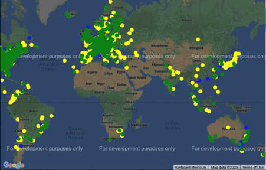
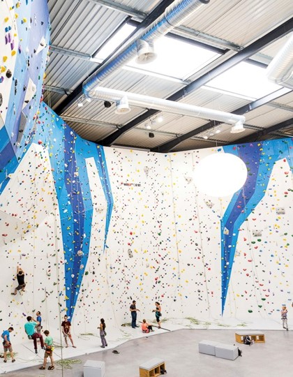
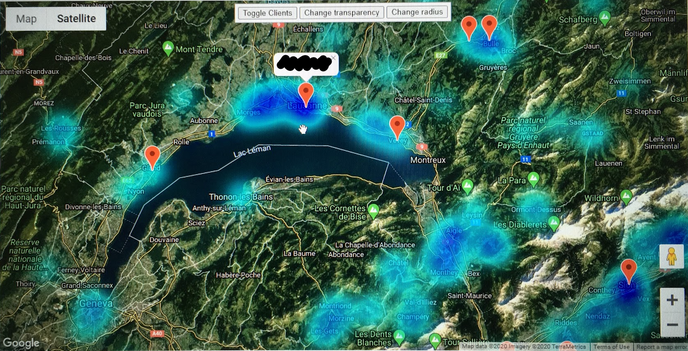

# Going beyond excel in the Corporate world

{ align=left width="30%" }

Buzzwords are a unavoidable in the corporate world. Over the last few years, as machine learning gets more accessible, companies' Business Intelligence and other analytics departments **try hard to bring those concepts to their reality**.

Part of the role of Digital Innovation in the contexts I have been involved was to **democratize these technologies**. Therefore I ran some projects to **show the value of Machine Learning early on** for companies and kick start discussions on how to integrate these technologies more broadly.

# Climbing gym market analysis

{ align=right width="30%" }

In one of these projects I worked on **market sizing**, something I had significant experience with from my days in Consulting. We were trying to respond to the question: where shall be the **next hotspots for growth of climbing gyms**?

The newness of the approach was to **apply data science** to scrape a large dataset of climbing gyms, and then **AI models** to **compete with the "classic approach"** which in this case would had been a **multi factor linear regression** in Excel.

# Technologies and approach

* **Web scrapping** of two public datasets on climbing gyms
* **Uniting these datasets** into an unique source, based on addresses
	* Since addresses are not comparable , we applied **geocoding** (Google Maps API) to get their coordinates
	* Comparing coordinates between entries on different bases to **check if they were the same**
	* Use **machine learning to classify** two coordinates, addresses and gym names as being the same or not
* Finding **macro-economic data** to correlate number of gyms to (we collaborated with an external Business Consultant for this)
* Dividing the world into "areas" and **forecasting how many gyms there is in such area** (by using proxies such as population, population density, surface, etc.)
* **Training and evaluating performance** of various machine learning models, then selecting the best one
* Application of the model, **identifying the places** in the world that should have more gyms than they currently have
* Create a **dynamic visualization tool** (used Google Maps API) to allow for easy interpretation of data

A data-sanitized, non proprietary, generic version of the algorithms can be found [here](https://drive.google.com/drive/folders/1nrFnYJ0pRVh6HYHlLpbyDnVkRncFfUHh?usp=share_link) (permission required).

<figure markdown>
  { width="100%" }
  <figcaption>An example of interactive display of data insights via heatmap (done for a similar business intelligence project)</figcaption>
</figure>