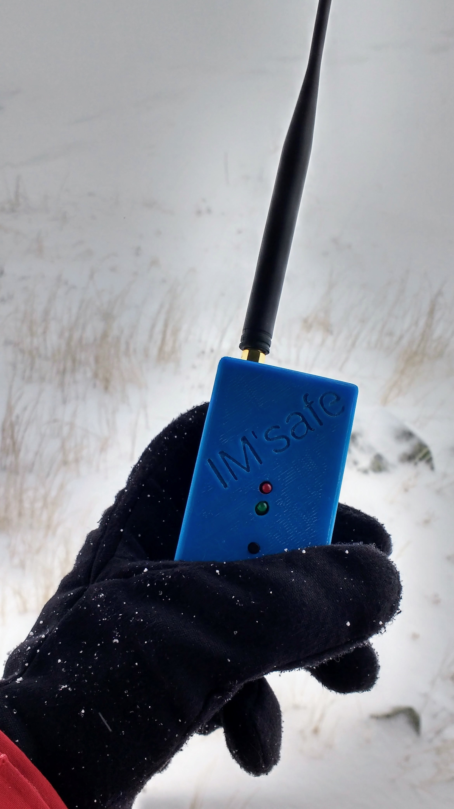
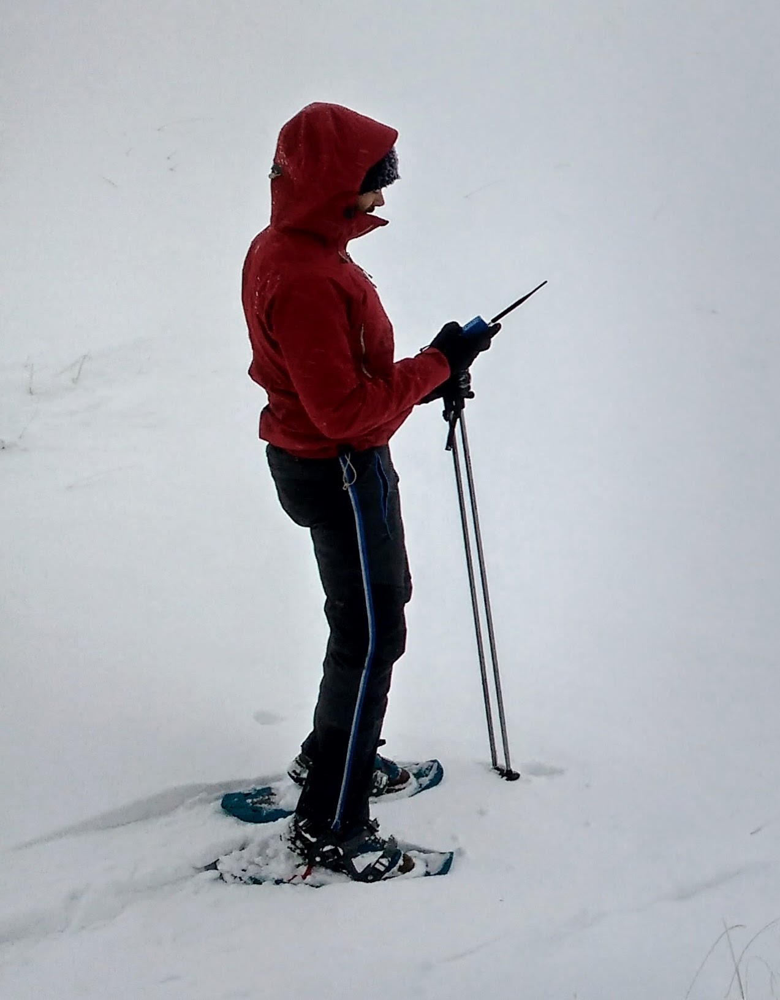
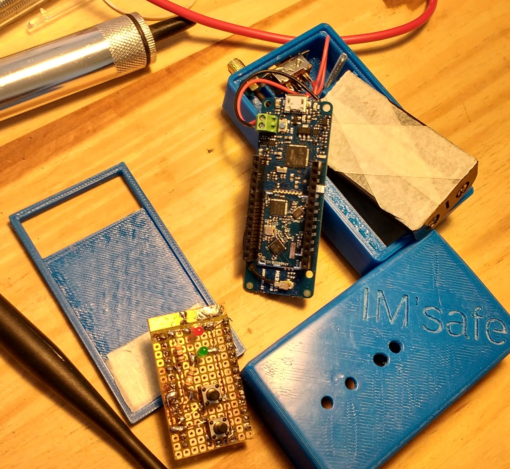
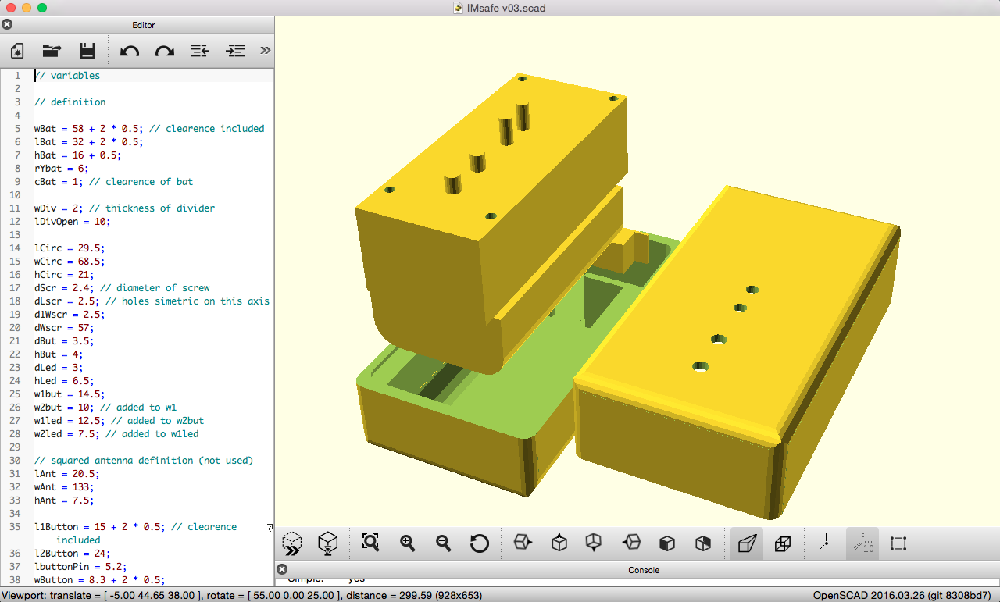

# Say 'hi' or ask for help anywhere

{ align=left width="17%" }

IM'safe can be used by outdoors people who need **seamless and reliable connectivity** with their families. It can also be used to allow **elder people** to live more independently. 

Via a web app, the user can define **which information** to send, and via **which channel (link, e-mail, sms**, for any number of people. It is also possible to link a **distress signal** to mountain rescue (in Europe for now).

The device uses the [Sigfox](https://www.sigfox.com/coverage/) network, that **works globally** and already covers significant parts of Europe.

> **IM'safe is a small device based on Sigfox global connectivity that allows users to send OK and / or position messages to designated people, as well as distress messages, including to mountain rescue**

# Stay connected, even while disconnecting

{ align=left width="20%" }

The idea behind IM'safe is to keep a connection in **moments we want to be disconnected** in the Outdoors.

As it works on a different network than our cellphones - with lower bandwidth but **more penetration into mountain regions** - it also works as a complementary connection.

#### IM'safe is the device for those who want to be offline in the outdoors but want to keep a life line for safety and communication of 'Im safe' messages

# Tested in real Alpine conditions

{ align=right width="40%" }

The first prototype of IM'safe has only 2 buttons:

* One that sends an **OK message - I'm safe** - to selected people via selected channels
* One that **asks for help and sends an approximate location (1km radius)** to people or directly to Mountain Rescue (in Europe)

A feedback LED light allows the user to confirm his **message was delivered**.

The device was **tested over one year** in the mountains surrounding Grenoble including high altitudes above 4.000m. It boasted **incredible reliability**, only missing a few spots occasionally. Battery life was exorbitant, **lasting over 6 months**.

# A market that has been validated

When the idea was developed in 2017, the market did not have many alternatives other than the **satellite based product Spot**. In contrast to Spot, IM'safe has less connectivity but **no subscription to expensive Satellite data** services. Spot was also criticized for not covering the entire globe.

Some other local solutions were seen in Outdoors fairs, quite similar to IM'safe using a **competitor network called LoRa**.

Then Garmin decided to enter the market more seriously with its **inReach**, offering better satellite connectivity than Spot and cool functions such as non distress messaging.

Finally, **Apple entered the distress signal market** back in 2018 with its fall detection and rescue calling on Apple Watch.

It is interesting to see that **IM'safe has been validated as a product idea** that saw the entry of other competitors, including some real heavy ones! The review website Outdoor Gear Lab curently has a dedicated [section](https://www.outdoorgearlab.com/topics/camping-and-hiking/best-personal-locator-beacon) to such devices.

<iframe width="560" height="315" src="https://www.youtube.com/embed/k4Hq0zwbTe4?si=s4DuOgWqznRRxD1c" title="YouTube video player" frameborder="0" allow="accelerometer; autoplay; clipboard-write; encrypted-media; gyroscope; picture-in-picture; web-share" allowfullscreen></iframe>

# Technology stack

{ align=right width="60%" }

* **Arduino [MKRFOX1200](https://partners.sigfox.com/products/arduino-mkrfox1200)** (arduino with embedded Sigfox capabilities)
* **3d printed** case, with solutions to improve waterprofness of case
* Simple **2 buttons 2 LEDs** user interface
* Simple **Flask app** with an API that receives a callback from Sigfox Backend and takes action to notify contacts