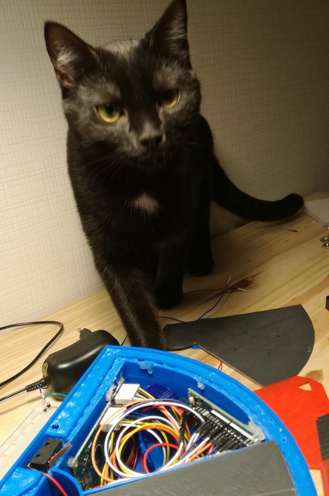
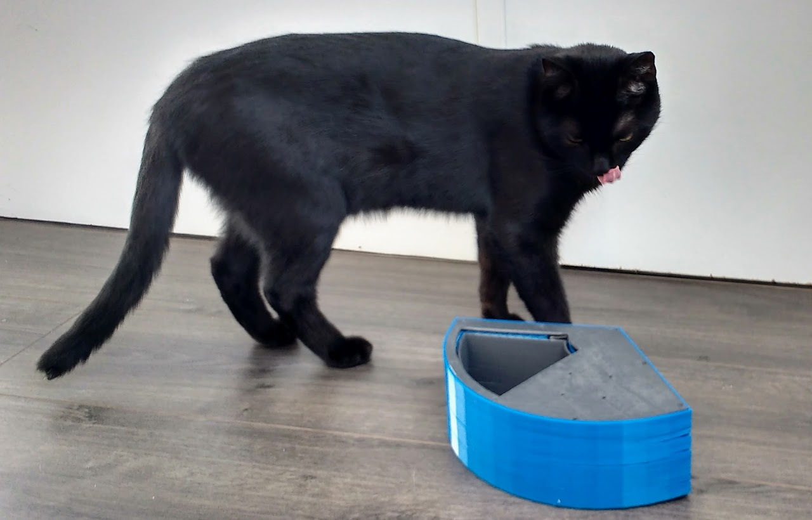

# For cat owners who travel often
{ align=left width="15%" }

Modern cat owners have a problem when they need to **leave their furry friends alone** for longer than one day. 

In an attempt to create some **interactiveness** at home while we are away, at the same time as keeping a normal **feeding frequency**, we played around with developing an automated cat feeder.

To spice things up, we decided to do a maker marathon over the weekend and see how far we could go in **developing the idea in 2 days**.

# From idea to prototype in one weekend
The challenge with this project was to develop and test its version zero in a **real agile sprint**. Was it possible to do it over one weekend?

  <iframe width="350" height="315" align="right" src="https://www.youtube.com/embed/KFbf75e2ZVk?si=soJr6q0FGIhRgGVK&amp;controls=0" title="YouTube video player" frameborder="0" allow="accelerometer; autoplay; clipboard-write; encrypted-media; gyroscope; picture-in-picture; web-share" allowfullscreen></iframe>

We found out it was. By using **simple electronics** and soldering while the mechanics was printing, we started assembling on Saturday, with firsts tests on Sunday.

Back then still new to 3d printing, we were astonished with the speed of the process: testing an idea in less than 48 hours from its conception was mind blowing!

Some design choices that helped us going fast:

* Mechanics design had **only 3 parts**, one of which with more than 95% of the material - this reduced the amount of prints and setup required
* Electronics with Arduino and small **protoboard** (with dedicated space in the mechanics)
* Motion with a **small servo**, whose axis served as pivot for the sliding door, reducing mechanics complexity significantly. Plus, added simplicity by using standard **servo libraries in Arduino** ecosystem

# An extendable platform
With testing we identified that after getting acquainted to the device, which does take time depending on how easily scared the cat gets, they do tend to get **very curious** about it. It might be the noises, the smell or the movement, but cats do engage!

{ align=left width="40%" }

On the next version we aim to develop more **games and interactiveness** as means to be in touch with the cats while we are away:

* Camera and voice
* Ability to throw elastics / paper balls
* Moving laser game

Another feature that we identified as interesting is using a camera to identify which cat it is and allow **selective feeding**. It It can indeed be a problem when one cat outweights others and get most of their food.

<iframe width="560" height="315" src="https://www.youtube.com/embed/gQShOV79NBE?si=Qls_GEvnf2_k8gV0" title="YouTube video player" frameborder="0" allow="accelerometer; autoplay; clipboard-write; encrypted-media; gyroscope; picture-in-picture; web-share" allowfullscreen></iframe>