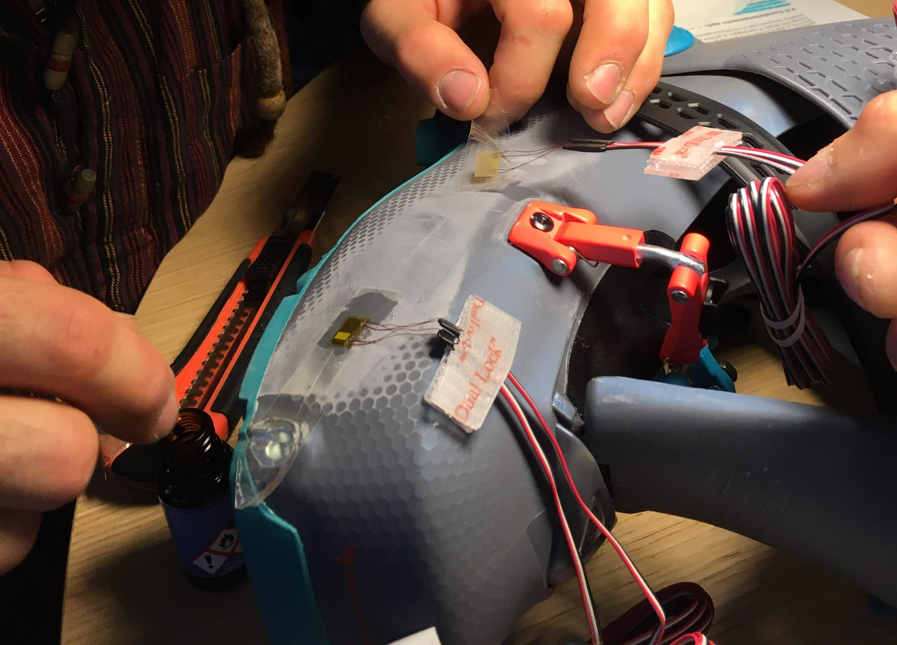

# An unprecedented experiment

{ align=left width="50%" }

While working as a Digital Innovation Specialist, we mapped the need to have better information to design ski boots.

The challenge is that boot design has organically arrived at some paradigms (e.g. the front lean applied by a skier maxes at around 100Kg of force), which had never been tested in real conditions in the past for lack of electronics means of acquiring such information. For instance, the cold conditions often seen in high altitude were a big challenge for batteries just a few years ago.

We set out to develop miniaturized data acquisition electronics, as well as testing the limits of sensor fusioning by measuring forces in plastic boots via strain gages.

The challenge, specially to use strain gauges, is not to be underestimated: these sensors have little range of motion and are not linear for high deformations: both things contributed to our belief that only machine learning could accurately resolve the problem. A real pioneer, uncertain quest for us.

# The tech stack

{ align=right width="50%" }

* 5 strain gauges attached to different positions in a test boot, following the key strain lines
* Wheatstone bridges to convert and amplify the strain gauges signal
* Arduino style (Adafruit Adalogger) to capture the signals, with a SD card extension for writing the Data. It also boasted a fast serial communication mode to pass the data in real time to a client in Python
* Post processing algorithms to transform the signals data into forces and insights for boot design

# Calibration experiment

<iframe width="560" height="315" src="https://www.youtube.com/embed/JIIGPhTIdh8?si=tmX4Klb7j0HBfncy" title="YouTube video player" frameborder="0" allow="accelerometer; autoplay; clipboard-write; encrypted-media; gyroscope; picture-in-picture; web-share" allowfullscreen></iframe>

We can see a test on the acquisition hardware and software, logging the data and allowing a preview on screen.

# A great problem for machine learning

The beauty of this project was that, given the non linearities and different interplay between the strain gages, a linear model was probably not the best choice to forecast. We indeed tested several models and got really good results in interpreting sensors values. In the end the accuracy we measured was a maximal difference of 13% between real and forecasted forces, very decent for a first version.

A repository containing anonimized data, as well as:

* Codes for logging the data on Adalogger
* Code for a serial listener and plotter in python
* Several cycles of analysis

<figure markdown>
  { width="100%" }
  <figcaption>Forecasted (blue) and real (red) forces on an early experiment</figcaption>
</figure>