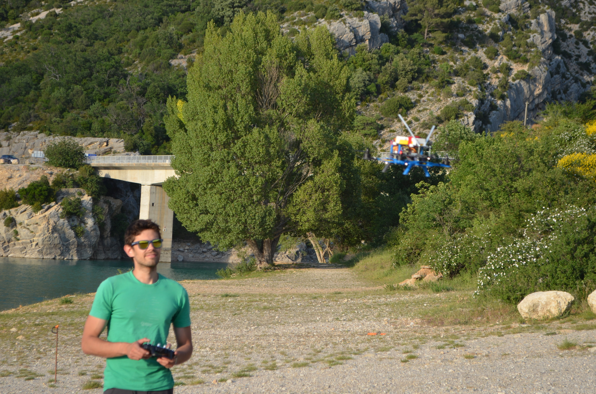
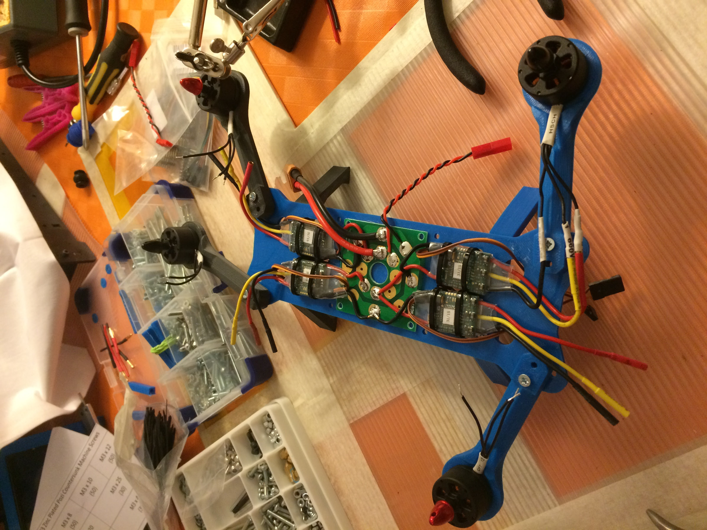

# Solving a problem amongst climbers
{ align=left width="50%" }

Nice shots while at the belay are often a problem for climbers on multi-pitch routes.

Often cramped with people and gear, on small ledges or overhanging terrain, belays are not the most inviting scenary for selfies.

On the other hand, the heights and impressiveness of climbing a big wall would make for great takes if taking them was easy.

Enter **Belay Cam: a mock project to learn about building, flying and controlling drones**.

# Technology stack
{ align=right width="20%" }
We have printed and built an open soure drone projects with the following characteristics:

*  MHQ open source foldable drone ([source](https://www.thingiverse.com/thing:251002)) **home printed** in ABS
* **ArduPilot** powered microcontroller ([source](https://ardupilot.org/))
* Standard drone motor **drivers, motors and helixes**

# First results
The first tests have been carried out on **completely human controlled **flights, as flying a drone was something new to me. We flew for several hours and **managed to do some hand take-offs** (not very common back in 2016), acquiring essential knowledge.

The drone **flew remarkably well** with ArduPilot's software with basic control parameters tunning. It also resisted several falls and drops.

The project has not been developed further, as around that time the first real small photo drones were arriving to market. It has nonetheless provided great **learning opportunities in advanced control, 3d printing and drone assembly**. 

<iframe width="560" height="315" src="https://www.youtube.com/embed/3qSmvdMwJwQ?si=dRJIXEjsl2qQPBe9" title="YouTube video player" frameborder="0" allow="accelerometer; autoplay; clipboard-write; encrypted-media; gyroscope; picture-in-picture; web-share" allowfullscreen></iframe>