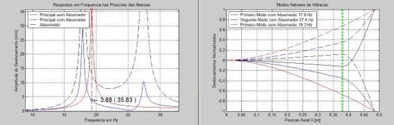

# One of those University projects we can't forget

{ align=left width="25%" }

Right about the end of university I really felt in **love with vibrations**.

The complexity of the **mathematical modeling** involved interested me right away, and alongside a group we developed a system that resembles the anti earthquake buildings.

Added to the challenge and group work, this project allowed me to apply knowledge of another passion back then: airplane model building.

# A moving target

{ align=right width="50%" }

In order to absorb vibrations, our system **moved a mass up and down**. To each vibration frequency, there is a height of the mass that minimizes almost completely the vibration.

We first developed a mechanical **model in finite elements** (back in 2010 it was still a fancy thing), to find out which lengths were needed.

Our system consisted of an aluminum bar of around one meter, with an **unbalanced computer fan glued to it**. When applying a tension to the fan, it spun at varying speeds, creating vibrations at various, unknown frequencies.

# The control loop

Our micro processor was programmed to, many times a second:

* Measure vibration **frequency via Fourier** transform (Fast Fourier)
* Calculate which **height of the mass** would dampen the perceived vibration
* Command a **stepper motor** to take the mass to that height
* **Adjust mass height** around that initial height by perceiving reminder vibration

# A complex mechanical solution

Besides the interesting mathematics and processing challenges in this project, I was particularly happy to apply knowledge I had from **model airplanes**. In this case, the small dimensions of the aluminum bar and the fact that is was vibrating, made it quite difficult to design a mechanism to move a mass around.

By using airplane model parts and ingenuity, we were able to accomplish a **reliable design** that inspired the colleagues in their mechanical designs.

<iframe width="560" height="315" src="https://www.youtube.com/embed/_i9IYchPBew?si=8Ztyrw1nPsc7FHva" title="YouTube video player" frameborder="0" allow="accelerometer; autoplay; clipboard-write; encrypted-media; gyroscope; picture-in-picture; web-share" allowfullscreen></iframe>

In this video we can (hardly) see the motor turning in the small setup and the mass moving as a consequence.