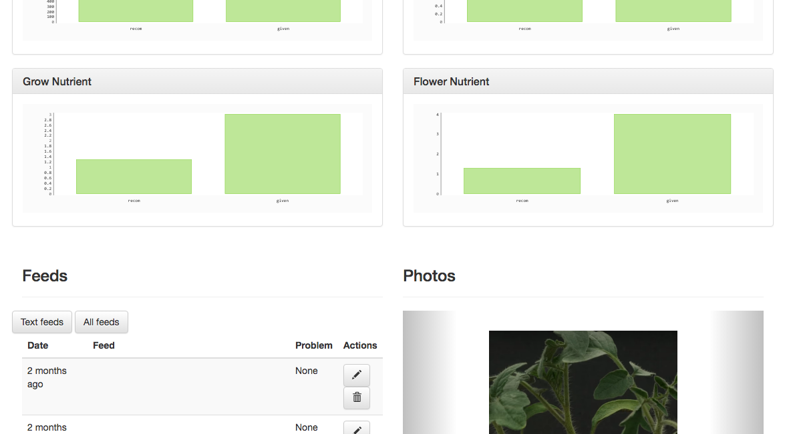

# iPlant - the connected garden

{ align=left width="30%" }

While working at the United Nations World Food Programme I got inspired by colleagues developing solutions to **improve small farmers yields with sensor technology**.

The idea to see health data for plants grew more and more mature to the point of developing a prototype, and by doing **learning about web development in Python**.

With lots of testing at our home garden, we had lots of learning opportunities both in web development and fruit growing; as well as **lots of fun** along the way!

# Like Google analytics plus Facebook, for plants

The features we planned for iPlant had a double objective: allow to **inspect plant health** through environment variables and **keep records of actions taken by the farmer**. The combination of these two features creates a sound mechanism to improve yields.

## Environment data

iPlant stores and displays data that link plant health with its environment variables:

* **Humidity** (in the ground and in air)
* **Temperature**
* **Light**

<figure markdown>
  
  <figcaption>Environment variables shown in graphs for a garden in iPlant</figcaption>
</figure>

## Plant journal

Alongside environment data, the we developed a journal tool. This was crucial in linking a plant's health its gardening historic:

* **Posts** to take notes on relevant events, including a 'problem' flag
* Possibility to include **pictures**
* **Register of additives** and other chemical treatments performed

<figure markdown>
  
  <figcaption>A typical plant page in iPlant, with pictures, posts and additives</figcaption>
</figure>

# Built with scalability in mind

{ align=left width="30%" }

iPlant is a prototype, but it is built on a structure that would allow rapid growth:

* Profiles for farmers, their gardens and plants were implemented: as many as needed can be created
* Registry of sensors, with safety features to guarantee only allowed sensors can transmit information. The app allows for third party sold sensors in the future
* Built in a modern technology (Flask in Python) with the possibility to deploy and adjust for a growing number of users

The code is open source and can be found on github **(link missing)**.

# Technology stack

* Web app built in **Python Flask**, deployed in **Heroku**
	* **API** that receives, checks and stores sensor data to its database
	* **Front end** web app where users can check their gardens and configure sensors / features
	
{ align=right width="30%" }	

* **Sensor clients**, with 4 sensors for environment tracking, in two forms:
	* One based on **Raspberry pi**, connected to the internet
	* One based on **Arduino MKRFOX1200**, a Sigfox based solution that allows deployment in many parts of the world and consumes little energy, ideal for field applications in Africa