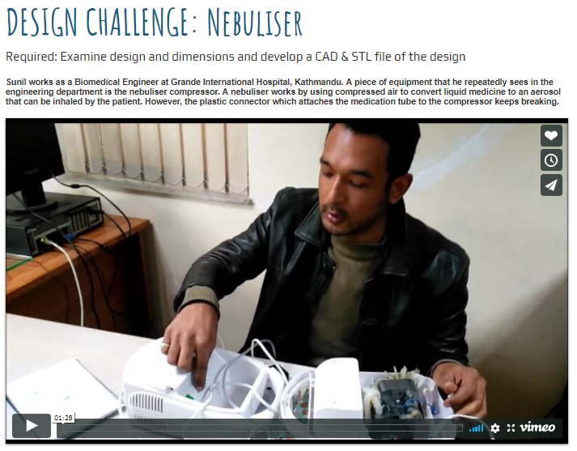
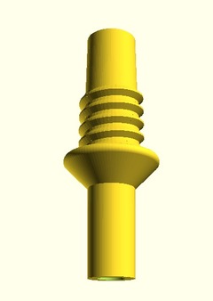

# Pipe connectors for humanitarian responses

During my tenure at the United Nations I met lots of interesting people, including the folks at [Field Ready](https://www.fieldready.org/).

At the time running the second fablab for humanitarian responses, they had gotten known for the great first example in Haiti. In Port-au-Prince, a fast production, 3D printer powered fablab was able to **solve logistics problems for provision of several critical items that saved many lives**.

For instance, they were able to **print and recycle umbilical cord clips**, which allowed to save many lives as those items did not get there in sufficient quantities after the earthquake.

# Can you print this?
FieldReady had a challenge to **design a pipe connector that could be 3d printed**. The challenge here comes from the fact that 3d printers **cannot print an overhang** of more than around 30% without support structures. These supports create problems by increasing print time, reducing surface quality and requiring extra time to remove support structures.

<figure markdown>
  
  <figcaption>Video proposing the challenge to develop the connector</figcaption>
</figure>

## The solution

{ align=left width="20%" }

To solve this problem we **engineered a fully 3d printable pipe connector** that does not need supports. It prints at a bevel angle below that of most printers' capacities, making sure there is no need for support material.

The solution is fully customizable via the open-source design software [openScad](https://openscad.org/). It is possible to define:

* Entry and exit diameters
* Length
* Thickness
* Bevel angle (feature which makes the design 3d printable without supports)

A link to the design, hosted in Thingiverse, can be found [here](https://www.thingiverse.com/thing:1409472/files).