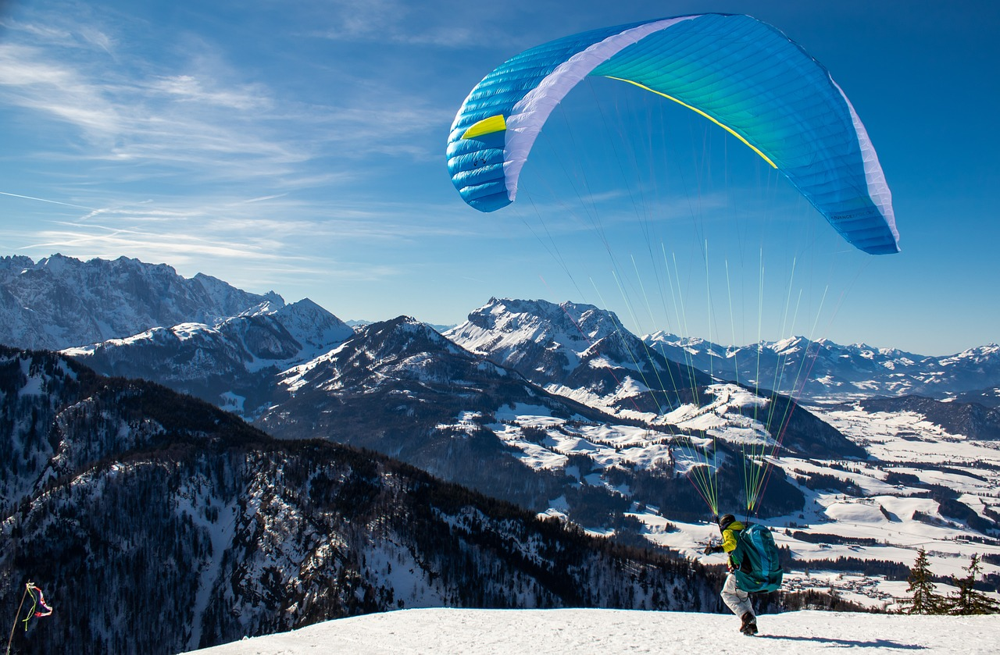
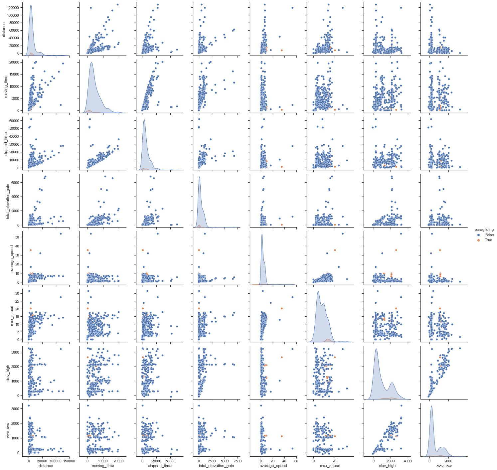
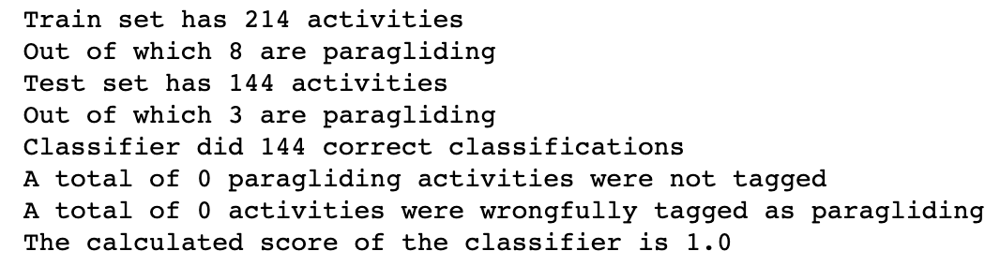

# Classifying Strava activities as Paragliding
{ align=left width="300" }
Strava doesn't have a Paragliding mode, therefore these activities get lost when uploading  with a sport watch (e.g. Suunto).

Is it possible to identify Paragliding activities a posteriori, by examining only simple activity parameters?

What did I want to achieve? 

An **algorithm to automatically identify Paragliding or Hike and Fly activities** in Strava

## A problem beyond human capacity
Strava makes available some general activity statistics such as time elapsed, average speed, max speed, max height, min height. Without additional info, it is clearly **impossible for a human to tag a Hike and Fly activity**: the speeds are similar to those in cycling, distances are within normal ranges for other activities, elevations as well.

{ width="700" }

From the above picture we can see the orange points - paragliding - mixed with those of many activities: there is simply simply **not enough differentiation in the 8 summary statistics** that Strava provides.

## Neural network in action
The very low amount of data (only 12 flights amongst 500+ activities) was discoragging. We decided to give it a try however.

We tested the MLP neural network classifier with 40% of split for testing. We didn't have to go any further, since the first iteractions provided perfect results: **the only 3 Paragliding activities amongst 144 were correctly tagged**.

{ align=left width="700" }

## Tech stack
* Strava API access via O-auth
* Seaborn for data exploration
* MLP classifier in Scikit-Learn for modelling

Here the repository of the code on [github](https://github.com/raphaFanti/glidelytics_activity_tagger).

## Next steps
To broaden the validity of these results one would have to use more data to train and assess the model. For this reason we shall **deploy the model as a service** so that people can tag their activities and provide feedback on accuracy.