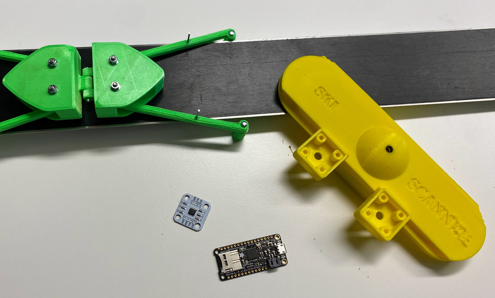
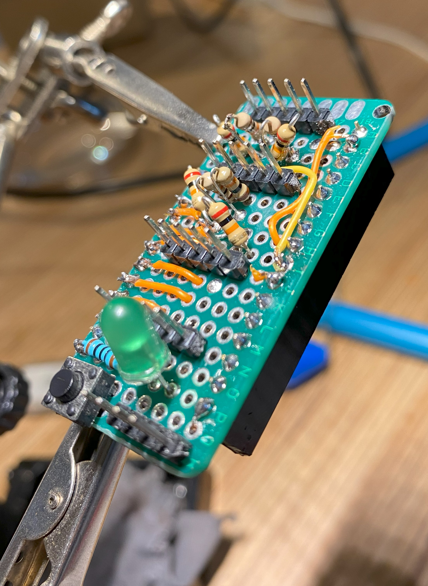
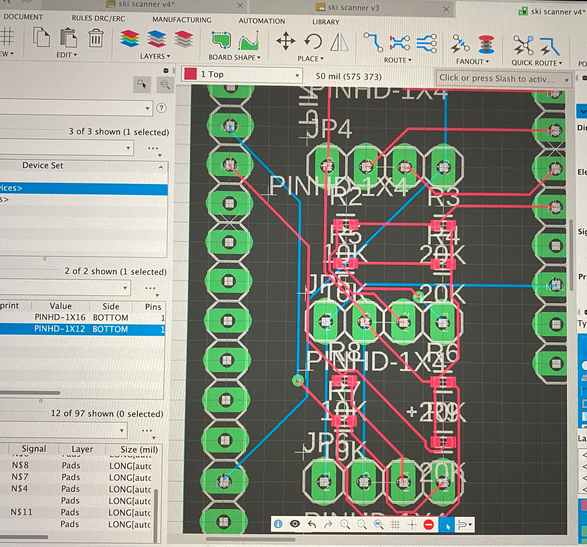
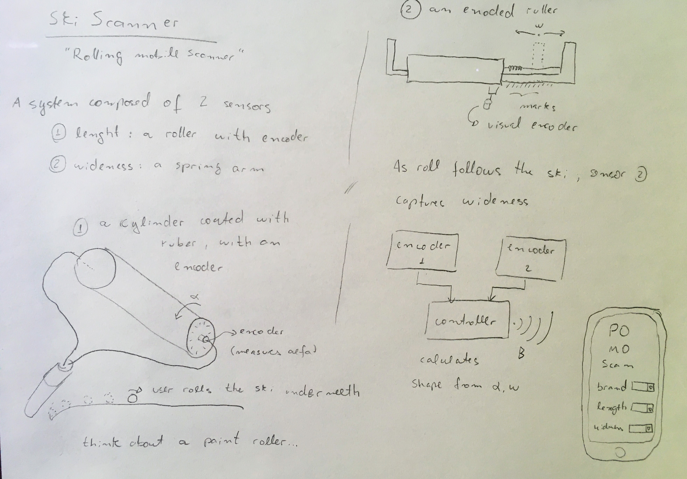

# Putting it all together

{ align=left width="40%" }

An interesting project in Digital Product development was the Ski Scanner. We needed to develop a **solution to "scan a ski", finding its shape to feed into a database**.

This was a **truly vertical project**, with all dimensions included: **robotics, electronics, 3D printing, Artificial intelligence** and **Web Development**.

This was also a great opportunity to **collaborate with other Engineers in the Team**, especially supporting the **development of a junior robotics engineer**.

# Working on all fronts

{ align=right width="30%" }

The system was developed in an agile way:

* General **architectures of solutions** were investigated (using a cellphone camera, using a "roller" style scanner, developing a stationary solution, etc.)
* Two mechanical **solutions were prototyped, 3D printed and tested**, allowing a comparison of performance and selection of a solution: a roller style scanner
* **Electronics were prototyped**, reading linear advancement and width of the skis as it is "rolled" through it
* A data pipeline was prototyped to **convert the "cloud of points" generated by the scanner into a ski shape** and associated measures
* A large **test campaign** was performed to validate the accuracy and usability of the solution
* **10 units were produced**:
	* Designed and ordered **professional electronic boards**
	* Printed and assembled the units
	* Tested each unit
* A **web service was developed** to allow for the processing of the files: the user uploads the file generated by the scanner, it gets processed and inserted in the Skis digital database, and the user can also directly download and check his past scans

# Technology stack

{ align=left width="30%" }

* Micro controller: **Adalogger** (SD card)
* Sensors: Swiss **precision magnetic encoders**, using **hardware interrupts** in the micro controller
* Circuit **board developed in Fusion 360**, several analog / digital conversors via voltage dividers (3.3 to 5V logic conversion)
* Data Science: **python, using pandas** to do several manipulations in the "points cloud" to transform it into curves via interpolation and checking against "expected ski curves"
* Web service: **web app developed in python Flask**, deployed to Heroku 

<figure markdown>
  { width="100%" }
  <figcaption>The original sketch of solutions for the Ski scanner</figcaption>
</figure>

The repository for the data logger code can be found [here](https://github.com/raphaFanti/skiScanner-DataLogger) and the one for the Web app can be found [here](https://github.com/isabellasoraruf/Web-services-ski-scanner).