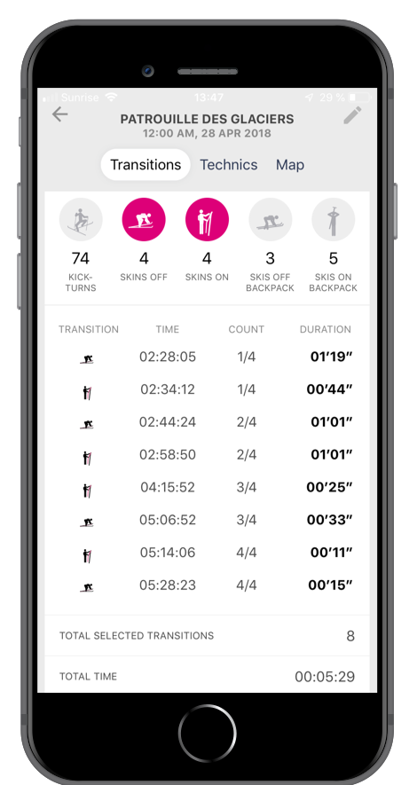

# The wonders of Bluetooth

{ align=left width="20%" }

I started in Oberalp as a Digital Innovation Specialist. Embedded in the Innovation team, we had the mandate to **infuse innovation to products**. My first development project there was to **connect a product to Suunto wathes**.

The first digital product for the company was a **Ski Touring tracker**: [Pomocup](https://pomocup.com/) promised to bring tracking to the sport, with features such as **power measurement, classification of different techniques, advanced analytics**.

# The problem: it's not in real time

{ align=right width="12%" }

The device had some real cool features, bringing some advanced analytics to the sport by using **machine learning** (for example to classify the movement) and **advanced biomechanical models** (specially important to measure power).

All of this was great, but most of these analysis ran in the cloud, after uploading.

It was clear that **not seeing this data during sport limited significantly the application of the device to training**.

# The solution - connect it to the smartwatch!

To solve this problem we proposed to simplify the algorithms to provide instant feedback to users, choosing the most important information to show:

* **Cadence**: very important measurement, and easy to calculate in the edge
* **Power**: we proposed a simpler algorithm for calculation in real time, using heart rate and some other motion metrics

With these metrics selected we moved to test the connection to Suunto watches, via Bluetooth standard profiles, the same way that heart rate belts work.

Within some hours of work we managed to connect to a watch as a power measurer standard profile and send cadence data. We used this proof of concept to discuss with the product developers and determine which changes in firmware needed to be implemented.

<iframe width="560" height="315" src="https://www.youtube.com/embed/6ufy-PDhE20?si=2T-57TwAeVhTbr4N" title="YouTube video player" frameborder="0" allow="accelerometer; autoplay; clipboard-write; encrypted-media; gyroscope; picture-in-picture; web-share" allowfullscreen>
</iframe>
We can see in the above video that rotating the wheel changes the cadence measurement in the watch.

