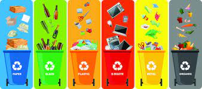
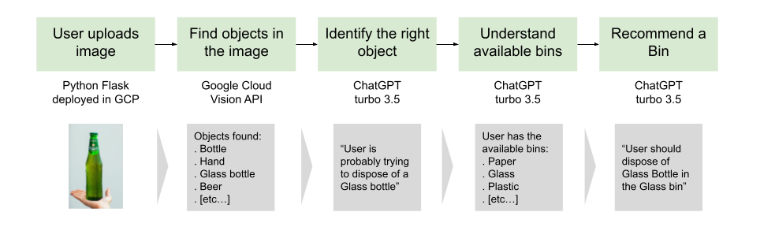

# A key challengefor the future of our planet

{ align=left width="50%" }

Waste management is a key problem in tackling Climate Change. As European countries step up their regulations and efforts, consumers are increasingly more involved in selective waste management. As treatment of waste is often managed locally by municipalities, rules about where to **discard each type of trash change** depending on location.

This project aimed at developing a fast prototype (in a matter of days) to evaluate the ability of LLMs and computer vision to solve this challenge. The user uploads an image and specifies his/her location: the app then responds with a **recommended trash bin**. 

# LLMs change the game

Developing a reliable classification system that outputs a recommended trash bin given an object to dispose of, given the **hyperlocal specificities** of the problem, used to be no easy game. It is so much the case that apps like [Junker](https://www.junkerapp.it/) often struggle to respond precisely and accurately (my personal opinion from some, non exhaustive testing).

Hence the idea to use **computer vision to detect the object in an image**, and then LLMs to understand contextually (depending on the user's location) which bins are available and which is the right one to dispose of the object.

{ width="90%" }

# Continuous learning by design

{ align=right width="50%" }

An interesting feature about this project is its continuous learning feature. With user's permission, it stores all the steps throughout the journey: the user is asked to confirm proposals or edit them.

With the information stored (in an SQL instance), we continously run retraining scripts to improve the models used at each step:

* Object identification
* Disposable object classification
* Trash bins available
* Object to dispose -> trash bin

# Tech stack

This project is an experiment with Web Development using LLMs APIs aiming at prototyping fast. It is open source (repo [here](https://github.com/raphaFanti/trash_disposal_app)). The technologies currently in use are:

* App developed in Flask in Python
* Containerized deployment in serverless Google Cloud Run
* Amazon SQL instance
* Google Vision API image annotation, the plan is to train a specific model on TensorFlow with the data gathered
* ChatGTP completions API, with prompt engeneered via examples for each of the steps. The plan is to use RAG to input location specific bins and rules 

You can beta **test the application [here](https://trash-disposal-app-hmriz2x7fq-uc.a.run.app/)**