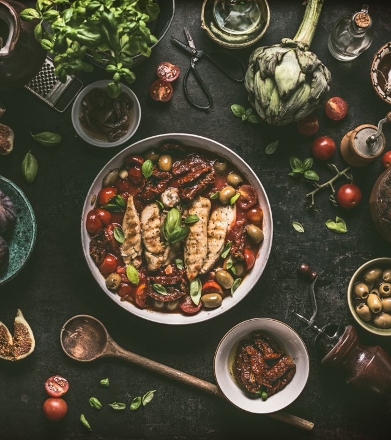
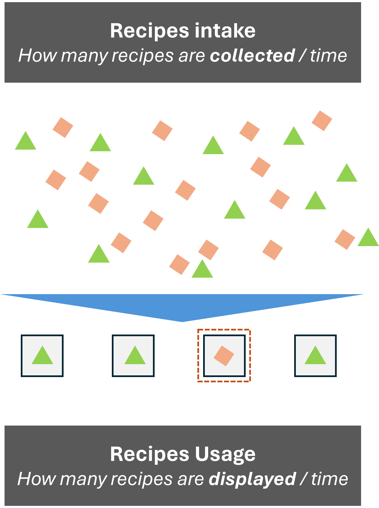
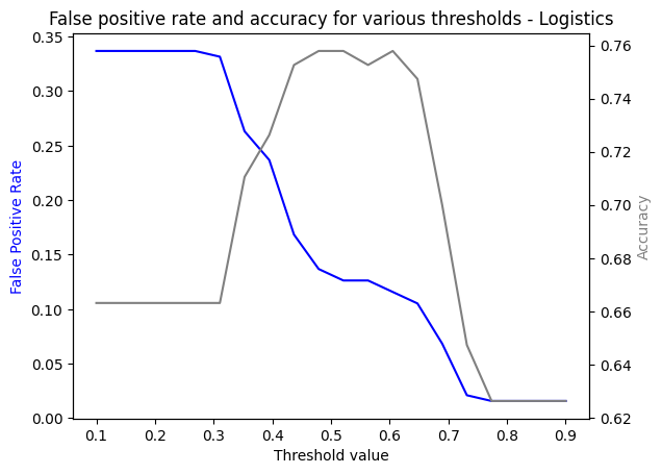

# The recipe for success

{ align=left width="30%" }

An interesting project proposed by Datacamp concerned identifying recipes for a recipe website which would draw high traffic and therefore increase the number of subscribers and increase revenue.

Welcome to the world of binary classification! Interestingly enough this type of problem is very relevant for many businesses, being used to identify fraud in credit cards, customer churn rates, etc.

In our project we looked at 900 recipes from the past, some of which had been tagged as "high-traffic". For each entry we had meta information about nutrient content (sugar, fat, etc), type of meal (breakfast, lunch, etc.), and amount of servings.

The challenge was to develop a predictive model to know, for new recipes, which were candidates for high-traffic, so as to display them more prominently on the website.

# Chasing the right metric

{ align=right width="30%" }

For binary classification problems it is possible to divide the errors in two groups: 
* False positives: when the prediction was positive but in reality the outcome was negative
* False negatives: when the prediction was negative but in reality the outcome was positive

In the case of **COVID tests**, for instance, the ideal test would minimize the rates of false negatives, as to make sure that when the test was negative, there would be low chance of the person would be infectious and spread the desease. False positives would be less of a problem, as a person diagnosed with COVID would not automatically receive a damaging treatment.

In the recipes case however, it is quite the opposite. The model had to be very selective to **flag only good candidates** for high traffic, therefore the best was to minimize the false positives. This came at the expense of "discarding" some potentially good recipes (false negatives).

{ align=right width="50%" }

The figure on the right shows the trade off: using a logistics regressor (good candidate for a model in this type of problem), we get as outcome the probability of a recipe being high-traffic. Therefore it is possible to set the threshold and optimize for the balance between the amount of recipes to display and how selective we want to be.

# A complete Data Science exercise

In this application project, besides the thinking about metrics and desired outcomes, it was possible to train all the major steps in Data Science:

* Data import and validation
* Exploratory analysis
* Pre-processing for machine learning (normalizatiom, creation of dummies, etc.)
* Model selection: in this case we tested simpler ones - such as logistics - through more sofisticated approaches as Ensemble learning (Gradient boostin, random forests). But the simpler models were more than sufficient for the amount of data at hands
* Testing
* Data storytelling and insights presentation

The full notebook for this project is available [here](https://app.datacamp.com/workspace/w/e2055169-3cd0-4c5c-be02-98fff863e4a5).

